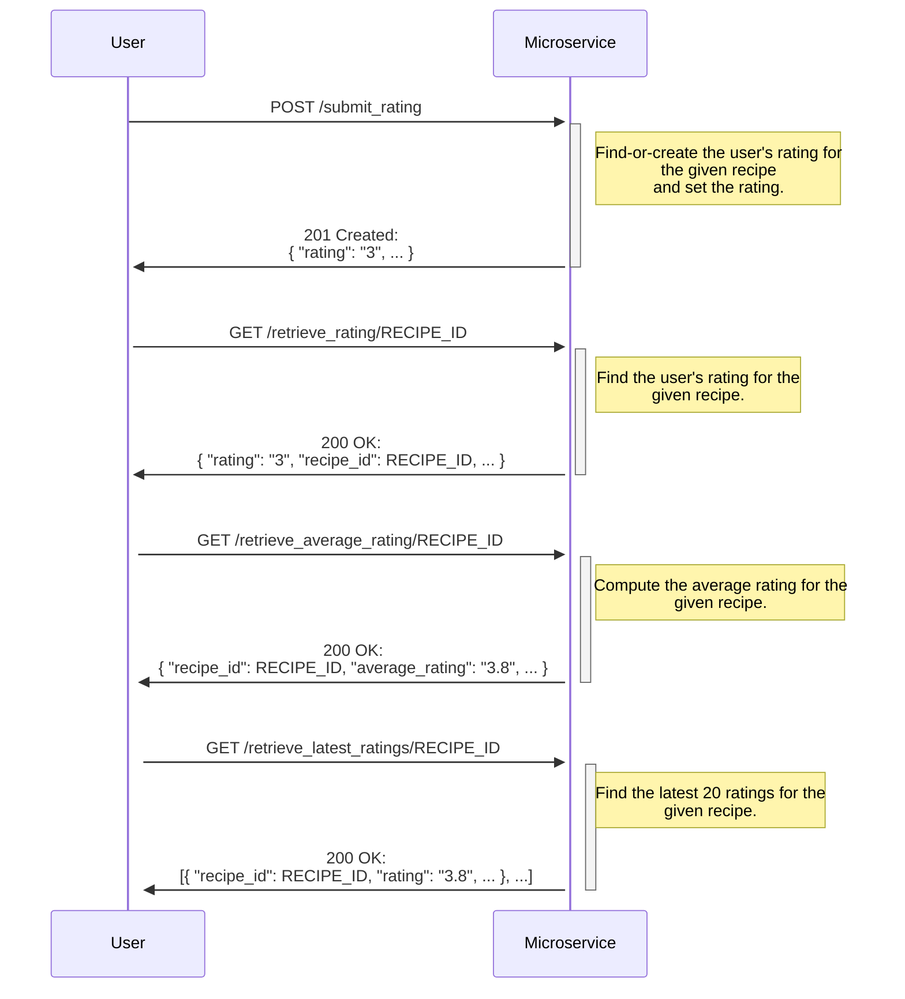

# Recipe Ratings Microservice

This app is a JSON HTTP REST API that allows users to submit and retrieve ratings for recipes.

⚠️ Currently, the microservice assumes the same user is logged in, and uses a dummy UUID called `FIXED_USER_ID` when fetching or storing data.

### Running the microservice

The app is written in the Ruby programming language, and can be run in two ways:

#### Via Ruby:

```
bundle install
bundle exec puma config.ru --log-requests
```

#### Via Docker:

`docker run -p 9292:9292 -it $(docker build -q .)`

## API Communication Contract

### POST /submit_rating

Submit your rating for a recipe with an HTTP request to the path "/submit_rating".

Returns JSON representation of the rating that was submitted.

##### Request Parameters:

* **recipe_id**: The id of the recipe you want to rate. (required)
* **rating**: The id of the recipe you want to rate. (required)
* **optional_comment**: The id of the recipe you want to rate. (optional)

##### Example Request

```shell
curl --silent -X POST \
  -d "recipe_id=1" \
  -d "rating=3" \
  -d "optional_comment=This+is+a+comment" \
  http://localhost:9292/submit_rating
```

##### Example Response
```json
{
  "rating": 3,
  "comment": "This is a comment",
  "id": "a3740a81-8949-434c-93e7-e9a4052da47e",
  "recipe_id": "1",
  "user_id": "085ebd10-2135-43ec-acc7-785f0d00fc8a",
  "created_at": "2024-11-19T01:39:59.413Z",
  "updated_at": "2024-11-19T02:34:34.212Z"
}
```

### GET /retrieve_rating/RECIPE_ID

Retrieve your rating for a recipe using an HTTP request to the path "/retrieve_rating/RECIPE_ID", where RECIPE_ID is the id of the recipe.

Returns JSON representation of the rating for the recipe that was requested.

##### Request Parameters:

* none

##### Example Request

```shell
curl --silent http://localhost:9292/retrieve_rating/1
```

##### Example Response

```json
{
  "id": "a3740a81-8949-434c-93e7-e9a4052da47e",
  "recipe_id": "1",
  "user_id": "085ebd10-2135-43ec-acc7-785f0d00fc8a",
  "rating": 3,
  "comment": "This is a comment",
  "created_at": "2024-11-19T01:39:59.413Z",
  "updated_at": "2024-11-19T02:34:34.212Z"
}
```

### GET /retreive_average_rating/RECIPE_ID

Retrieve the average rating for a recipe using an HTTP request to the path "/retreive_average_rating/RECIPE_ID", where RECIPE_ID is the id of the recipe.

Returns JSON object containing the average rating for the recipe requested, as well as the total number of ratings for it.

##### Request Parameters:

* none

##### Example Request

```shell
curl --silent http://localhost:9292/retreive_average_rating/1
```


##### Example Response

```json
{
  "recipe_id": "1",
  "ratings_count": 5,
  "average_rating": "3.8"
}
```

### GET /retrieve_latest_ratings/RECIPE_ID

Retrieve the latest 20 ratings for a recipe using an HTTP request to the path "/retrieve_latest_ratings/RECIPE_ID", where RECIPE_ID is the id of the recipe.

Returns a JSON array of up to 20 of the latest ratings for the recipe that was requested.

##### Request Parameters:

* none

##### Example Request

```shell
curl --silent http://localhost:9292/retrieve_latest_ratings/1
```

##### Example Response

```json
[
  {
    "recipe_id": "1",
    "rating": 3,
    "comment": "This is a comment",
    "user_id": "085ebd10-2135-43ec-acc7-785f0d00fc8a"
  },
  {
    "recipe_id": "1",
    "rating": 7,
    "comment": "This is a new comment for my recipe review.",
    "user_id": "585ebd10-2135-43ec-acc7-785f0d00fc8a"
  }
]
```

## API Diagram

